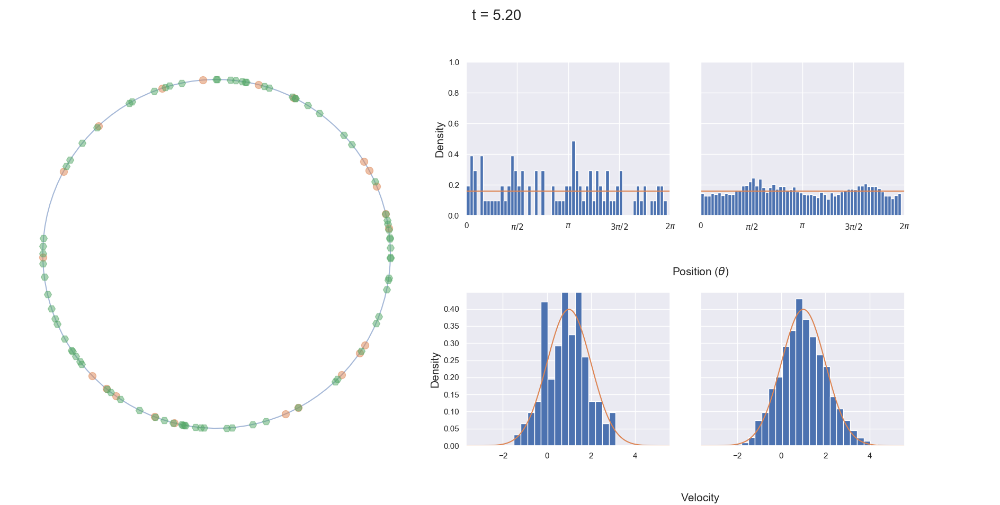

# Numerical Methods for an Interacting Particle System
<p align="center">
<a href="https://mybinder.org/v2/gh/Tom271/InteractingParticleSystems/master"></a>
<a href="https://github.com/psf/black"></a>
</p>

This package simulates the interacting particle system of Buttà et al. [[1]](#references) as well as the related model of Garnier et al. [[2]](#references)

## Installation
  To install the package, download the repository and open the terminal. Navigate to the directory containing the repo using `cd \PATH_TO_FOLDER\` then run `pip install .` – don't forget the period! The package can then be called using the standard  `import particle`. You can check everything is working by running `pytest` from within the directory.

## Basic Running
  All the functionality is contained within the `particle` folder. Code defining the herding and interaction functions is contained in separate files. The main calculations are contained in `simulate.py`. There is also a file `plotting.py` with some basic plotting functionality and animations.

### Obtaining Trajectories
  To simulate the particle model the basic format is
  ```python
  t,x,v = run_full_particle_system(
      particles=100,
      D=1,
      initial_dist_x="two_clusters",
      initial_dist_v="pos_normal_dn",
      interaction_function="Gamma",
      dt=0.1,
      T_end=100,
      herding_function="Step",
      L=2 * np.pi ,
      denominator="Full",
      gamma=1 / 10,
  )
  ```
One can then produce an animation using the `anim_full` function from `plotting.py`:  
```python
  ani = plotting.anim_full(t, x, v, mu_v=1, variance=1, L=2 * np.pi , framestep=1)
```
This gives an animation of the particles moving on the torus (green if moving clockwise, orange if anticlockwise) as well as four histograms. The top two histograms are of the particles positions at the current time, t (left) and positions up to the current time step [0,t] (right). The bottom two histograms are the same but for the velocities of the particles.


### Parameter Options
  For the full particle system, the following parameters are available.
  - `particles`: integer, number of particles to simulate

  - `dt`: float, time step to be use in Euler-Maruyama scheme

  - `T_end`: time at which to end simulation, float

  - `L`: the circumference of the circle on whish the particles move, float

  - `D`: diffusion coefficient, denoted $\sigma$ in the model

  - `initial_dist_x`: the initial positions of the particles. This can either be given as an array of length `particles` or alternatively can be one of:
    + `"uniform_dn"`: a [uniform distribution](https://en.wikipedia.org/wiki/Uniform_distribution_(continuous)) on $[0,L]$
    + `"one_cluster"`: a cluster of particles of width 2π /10 and centre π /2.
    + `"two_clusters"`: two clusters of particles both with width 2π /10 and centred at  π /2 and 3π /2

  - `initial_dist_v`:  the initial velocities of the particles. This can either be given as an array of length `particles` or alternatively can be one of:
    + `"pos_normal_dn"`: a [normal distribution](https://en.wikipedia.org/wiki/Normal_distribution) with mean 1 and variance 2.
    + `"neg_normal_dn"`: a [normal distribution](https://en.wikipedia.org/wiki/Normal_distribution) with mean -1 and variance 2.
    + `"uniform_dn"`: a [uniform distribution](https://en.wikipedia.org/wiki/Uniform_distribution_(continuous)) on [0,1]
    + `"cauchy_dn"`: a standard [Cauchy distribution](https://en.wikipedia.org/wiki/Cauchy_distribution). *Note:* the simulation may not be stable when using this distribution due to its undefined mean.
    + `"gamma_dn"`: a [Gamma distribution](https://en.wikipedia.org/wiki/Gamma_distribution) with shape 7.5 and scale 1.0

  - `interaction_function`: the interaction function φ, determined from a dictionary using one of the following strings:
    + `"Zero"`: no interaction between particles
    + `"Uniform"`: every particle interacts with every other particle equally, irrespective of separation
    + `"Indicator"`: a particle interacts with another if they are separated by less than L/10
    + `"Gamma"`: a particle interacts with another if they are separated by less than γ*L. Here γ is defined by the parameter `gamma`
    + `"Smoothed Indicator"`: An indicator function without the discontinuity
    + `"Garnier"`: the interaction function of [[2]](#references)

  - `gamma`: a float between 0 and 1 that is used if the `interaction_function` is ``"Gamma"``

  - `well_depth`: a float greater than 4 that is used if the `interaction_function` is ``"Garnier"``

  - `herding_function`: the herding function G, determined from a dictionary using one of the following strings:
    + `"Zero"`: no herding takes place
    + `"Step"`: a step function herding common in the literature
    + `"Smooth"`: a smooth herding function more amenable to analysis
    + `"Garnier"`: the herding function of [[2]](#references).


  - `denominator`: the denominator of the fraction in the interaction term (the argument of G) can be either:
    + `"Full"`: scales the interaction by the number of particles the current particle is interacting with
    + `"Garnier"`: scales the interaction by the total number of particles in the system, as in [[2]](#references)


  When simulating the space-homogeneous system, all the parameters are identical except there is no initial condition on the positions; no interaction functions and no denominator or domain length as these obviously all depend on space.

#### References:
[1] [P. Buttà, F. Flandoli, M. Ottobre, and B. Zegarlinski. A non-linear kinetic model of self-propelled particles with multiple equilibria. Kinetic & Related Models, 12(4):791–827, 2019.](https://arxiv.org/abs/1804.01247)

[2] [J. Garnier, G. Papanicolaou, T-W. Yang, Mean field model for collective motion bistability, Discrete & Continuous Dynamical Systems, 24(2): 851-879, 2019.](https://arxiv.org/abs/1611.02194)


Hans Petter Langtangen, Svein Linge, [Finite Difference Computing
with PDEs - A Modern Software
Approach](https://hplgit.github.io/fdm-book/doc/pub/book/pdf/fdm-book-4screen.pdf)


**The authors were supported by The Maxwell Institute Graduate School in Analysis and its Applications, a Centre for Doctoral Training funded by the UK Engineering and Physical Sciences Research Council (grant EP/L016508/01), the Scottish Funding Council, Heriot-Watt University and the University of Edinburgh.**

#### Up Next:

- [ ] Improve functionality and add docs for saving to file in `parameter_testing`
- [ ] Improve `plot_data` and loading from file with docs
- [ ] Add deterministic test cases
- [ ] Write expected behaviour file
- [ ] Add docs for calculating CL2
- [ ] Implement order parameter
